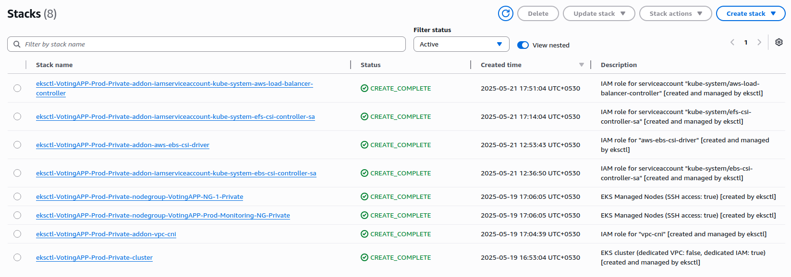

🚀 EKS Cluster Creation with Kubernetes Version 1.32
1. 🔐 Create KMS Key

Refer to the KMS settings in the KMS PDF to create the key using AWS Console or AWS CLI.
2. 🌐 Create VPC

Follow the exact steps mentioned in the VPC Document. Ensure all required subnets, routing tables, NAT gateways, and associated components are set up correctly.
3. ⚙️ Jenkins Setup

On the Jenkins server:

    Install AWS CLI:

sudo apt install awscli -y

Install eksctl:

curl --silent --location "https://github.com/eksctl-io/eksctl/releases/latest/download/eksctl_$(uname -s)_amd64.tar.gz" | tar xz -C /tmp
sudo mv /tmp/eksctl /usr/local/bin

Install kubectl:

    curl -o kubectl https://s3.us-west-2.amazonaws.com/amazon-eks/1.32.0/2024-05-21/bin/linux/amd64/kubectl
    chmod +x ./kubectl
    sudo mv ./kubectl /usr/local/bin

    📌 Admin Access: Jenkins server should temporarily have cluster-admin role. Once the cluster is created, update IAM roles/policies for least-privilege access.

✅ Get Optimized AMI ID

Use the following command to retrieve the Amazon Linux 2023 AMI for EKS v1.32 (replace 1.31 with 1.32 when available):

aws ssm get-parameter --name /aws/service/eks/optimized-ami/1.31/amazon-linux-2023/x86_64/standard/recommended/image_id --region ap-south-1 --query "Parameter.Value" --output text

📖 AMI Reference
4. 🏗️ Apply cluster.yaml

Once the cluster configuration is applied:

    EKS endpoints will be created.

    Navigate to Endpoint Security Group > Inbound Rules

    Add a rule:
    Type: All Traffic
    Source: VPC CIDR
    (This is mandatory.)

📸 Screenshot Example

5. 🔧 Post Cluster Creation Components

After successful creation of the EKS Cluster and Node Group:

    Install and configure core components.

    Refer to the screenshots below for configuration references:

6. 📦 Install EBS CSI Driver - https://docs.aws.amazon.com/eks/latest/userguide/ebs-csi.html#eksctl_store_app_data

Amazon EBS CSI driver enables EBS volume management via Kubernetes.
📚 EBS CSI Driver Setup Guide

7. 📁 Install EFS CSI Driver - https://docs.aws.amazon.com/eks/latest/userguide/efs-csi.html

EFS CSI driver allows you to mount EFS file systems in your pods.
📚 EFS CSI Driver Setup Guide

8. 🌐 Install AWS Load Balancer Controller - https://docs.aws.amazon.com/eks/latest/userguide/lbc-helm.html

Manage external and internal load balancers in AWS via Kubernetes.
📚 Load Balancer Controller Setup Guide

   

